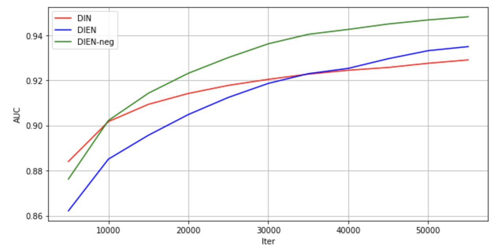

DIEN model is developed from the paper "Deep Interest Evolution Network for Click-Through Rate Prediction" https://arxiv.org/abs/1809.03672
In this repo, the model is revised to accommandate the Taobao user behavior history data with some sampling and post-precessing. 
# Data
In our repo, we have processed the data and stored into Tianchi Platform. Following below instructions to fetch it:
```
https://tianchi.aliyun.com/dataset/dataDetail?dataId=81505
```
After downloading, please put the file under DIEN,your model folder. Please untar the folder. 

# Enviroment
The reference use Nvidia docker.
```
docker pull nvcr.io/nvidia/tensorflow:19.10-py3
```
Set up docker container by
```
docker run --gpus all --privileged=true  --shm-size=1g --ulimit memlock=-1 --ulimit stack=67108864 --name=tensorflow-nv -it --rm -v yourdirectory/DIEN:/DIEN --network=host  nvcr.io/nvidia/tensorflow:19.10-py3
```
Map your data_dir folder to the container space.

# Run
The command to run this model is quite easy. Please check the command below. **model** can be DIEN_with_neg, DIEN, DIN, etc.. 
Please check the source code to find more model choice. **rand** is any integer number for random seed.

`python train_taobao_processed_allfea.py train <model> <rand>`
Please make sure your data dir is correctly specified in train_taobao_processed_allfea.py.

We have made 5 runs for each model(each line represents mean values for 5 runs) to show the model accuracy of AUC for predicting the user click-through rate. 

